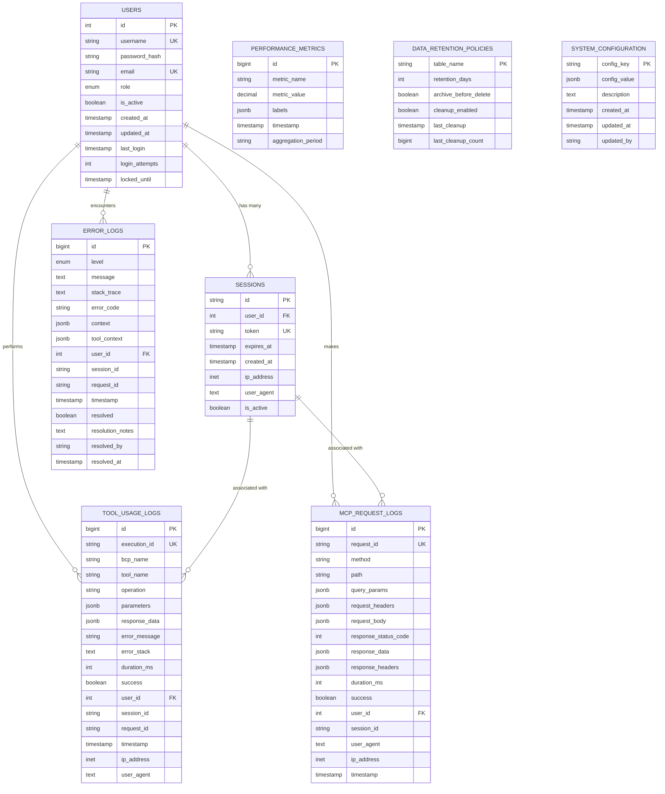

# Database Architecture Design

## Executive Summary

This document specifies the complete database architecture for the HubSpot MCP Analytics Dashboard, designed for high-performance analytics workloads with efficient time-series data storage, real-time querying capabilities, and automated data lifecycle management. The architecture leverages PostgreSQL's advanced features including partitioning, JSONB indexing, and materialized views for optimal performance.

## Database Technology Stack

### PostgreSQL 15+ Features Utilized
- **Table Partitioning**: Date-based partitioning for time-series analytics data
- **JSONB Data Type**: Flexible storage for parameters and context data with GIN indexing
- **Materialized Views**: Pre-computed aggregations for dashboard performance
- **Row Level Security**: Future-proofing for multi-tenant scenarios
- **Advanced Indexing**: Composite, partial, and expression indexes for query optimization
- **Native JSON Operations**: Efficient querying and manipulation of JSON data

### Railway PostgreSQL Configuration
- **Managed Service**: Automated backups, updates, and monitoring
- **Connection Pooling**: Built-in pgbouncer integration
- **SSL Encryption**: TLS 1.3 encryption for data in transit
- **Automated Scaling**: Dynamic resource allocation based on load
- **Point-in-Time Recovery**: Continuous backup with PITR capability

## Core Database Schema

### Entity Relationship Diagram



## Detailed Table Specifications

### Users Table
```sql
CREATE TABLE users (
    id SERIAL PRIMARY KEY,
    username VARCHAR(255) UNIQUE NOT NULL,
    password_hash VARCHAR(255) NOT NULL, -- bcrypt with salt rounds >= 12
    email VARCHAR(255) UNIQUE,
    role user_role_enum DEFAULT 'ADMIN',
    is_active BOOLEAN DEFAULT true,
    created_at TIMESTAMP WITH TIME ZONE DEFAULT CURRENT_TIMESTAMP,
    updated_at TIMESTAMP WITH TIME ZONE DEFAULT CURRENT_TIMESTAMP,
    
    -- Security and audit fields
    last_login TIMESTAMP WITH TIME ZONE,
    login_attempts INTEGER DEFAULT 0,
    locked_until TIMESTAMP WITH TIME ZONE,
    
    -- Additional metadata
    first_name VARCHAR(255),
    last_name VARCHAR(255),
    timezone VARCHAR(50) DEFAULT 'UTC',
    preferences JSONB DEFAULT '{}',
    
    -- Audit fields
    created_by INTEGER REFERENCES users(id),
    updated_by INTEGER REFERENCES users(id)
);

-- User role enumeration
CREATE TYPE user_role_enum AS ENUM ('ADMIN', 'READ_ONLY', 'SUPER_ADMIN');

-- Indexes
CREATE INDEX idx_users_username ON users(username);
CREATE INDEX idx_users_email ON users(email) WHERE email IS NOT NULL;
CREATE INDEX idx_users_active ON users(is_active) WHERE is_active = true;
CREATE INDEX idx_users_locked ON users(locked_until) WHERE locked_until IS NOT NULL;
```

### Sessions Table
```sql
CREATE TABLE sessions (
    id VARCHAR(255) PRIMARY KEY, -- CUID or similar
    user_id INTEGER NOT NULL REFERENCES users(id) ON DELETE CASCADE,
    token VARCHAR(500) UNIQUE NOT NULL, -- JWT refresh token or session token
    expires_at TIMESTAMP WITH TIME ZONE NOT NULL,
    created_at TIMESTAMP WITH TIME ZONE DEFAULT CURRENT_TIMESTAMP,
    last_accessed TIMESTAMP WITH TIME ZONE DEFAULT CURRENT_TIMESTAMP,
    
    -- Request context
    ip_address INET,
    user_agent TEXT,
    is_active BOOLEAN DEFAULT true,
    
    -- Session metadata
    session_data JSONB DEFAULT '{}',
    
    -- Security tracking
    login_method VARCHAR(50) DEFAULT 'password', -- 'password', 'api_key', etc.
    mfa_verified BOOLEAN DEFAULT false,
    
    CONSTRAINT chk_expires_future CHECK (expires_at > created_at)
);

-- Indexes
CREATE INDEX idx_sessions_token ON sessions(token);
CREATE INDEX idx_sessions_user_active ON sessions(user_id, is_active) WHERE is_active = true;
CREATE INDEX idx_sessions_expires ON sessions(expires_at);
CREATE INDEX idx_sessions_ip ON sessions(ip_address);

-- Automatic cleanup of expired sessions
CREATE INDEX idx_sessions_cleanup ON sessions(expires_at) WHERE expires_at < CURRENT_TIMESTAMP;
```

### Tool Usage Logs Table (Partitioned)
```sql
-- Create partitioned table for tool usage logs
CREATE TABLE tool_usage_logs (
    id BIGSERIAL,
    execution_id VARCHAR(255) UNIQUE NOT NULL,
    bcp_name VARCHAR(100) NOT NULL,
    tool_name VARCHAR(100) NOT NULL,
    operation VARCHAR(100) NOT NULL,
    
    -- Request/Response data
    parameters JSONB,
    response_data JSONB,
    
    -- Error handling
    error_message TEXT,
    error_stack TEXT,
    error_code VARCHAR(50),
    
    -- Performance metrics
    duration_ms INTEGER NOT NULL,
    memory_usage_mb DECIMAL(10,2),
    cpu_usage_percent DECIMAL(5,2),
    
    -- Status and classification
    success BOOLEAN NOT NULL,
    tool_version VARCHAR(20),
    
    -- Context and audit
    user_id INTEGER REFERENCES users(id),
    session_id VARCHAR(255),
    request_id VARCHAR(255),
    timestamp TIMESTAMP WITH TIME ZONE DEFAULT CURRENT_TIMESTAMP,
    
    -- Request metadata
    ip_address INET,
    user_agent TEXT,
    
    -- Additional analytics
    parameters_hash VARCHAR(64), -- SHA-256 hash for deduplication
    response_size_bytes INTEGER,
    cache_hit BOOLEAN DEFAULT false,
    
    PRIMARY KEY (id, timestamp)
) PARTITION BY RANGE (timestamp);

-- Create monthly partitions (automated via pg_partman or custom procedure)
CREATE TABLE tool_usage_logs_2024_08 PARTITION OF tool_usage_logs
    FOR VALUES FROM ('2024-08-01 00:00:00+00') TO ('2024-09-01 00:00:00+00');

CREATE TABLE tool_usage_logs_2024_09 PARTITION OF tool_usage_logs
    FOR VALUES FROM ('2024-09-01 00:00:00+00') TO ('2024-10-01 00:00:00+00');

CREATE TABLE tool_usage_logs_2024_10 PARTITION OF tool_usage_logs
    FOR VALUES FROM ('2024-10-01 00:00:00+00') TO ('2024-11-01 00:00:00+00');

-- Indexes on partitioned table
CREATE INDEX idx_tool_usage_bcp_time ON tool_usage_logs(bcp_name, timestamp DESC);
CREATE INDEX idx_tool_usage_tool_time ON tool_usage_logs(tool_name, timestamp DESC);
CREATE INDEX idx_tool_usage_operation_time ON tool_usage_logs(operation, timestamp DESC);
CREATE INDEX idx_tool_usage_user_time ON tool_usage_logs(user_id, timestamp DESC);
CREATE INDEX idx_tool_usage_success ON tool_usage_logs(success, timestamp DESC);
CREATE INDEX idx_tool_usage_duration ON tool_usage_logs(duration_ms) WHERE duration_ms > 5000;
CREATE INDEX idx_tool_usage_execution_id ON tool_usage_logs(execution_id);
CREATE INDEX idx_tool_usage_request_id ON tool_usage_logs(request_id);

-- JSONB indexes for parameter and response searching
CREATE INDEX idx_tool_usage_parameters_gin ON tool_usage_logs USING GIN (parameters);
CREATE INDEX idx_tool_usage_response_gin ON tool_usage_logs USING GIN (response_data);

-- Hash index for deduplication
CREATE INDEX idx_tool_usage_params_hash ON tool_usage_logs(parameters_hash);
```

### MCP Request Logs Table (Partitioned)
```sql
CREATE TABLE mcp_request_logs (
    id BIGSERIAL,
    request_id VARCHAR(255) UNIQUE NOT NULL,
    
    -- Request details
    method VARCHAR(10) NOT NULL,
    path TEXT NOT NULL,
    query_params JSONB,
    request_headers JSONB,
    request_body JSONB,
    
    -- Response details
    response_status_code INTEGER NOT NULL,
    response_data JSONB,
    response_headers JSONB,
    response_size_bytes INTEGER,
    
    -- Performance metrics
    duration_ms INTEGER NOT NULL,
    queue_time_ms INTEGER,
    processing_time_ms INTEGER,
    
    -- Status and metadata
    success BOOLEAN NOT NULL,
    error_type VARCHAR(50),
    
    -- Context
    user_id INTEGER REFERENCES users(id),
    session_id VARCHAR(255),
    timestamp TIMESTAMP WITH TIME ZONE DEFAULT CURRENT_TIMESTAMP,
    
    -- Client information
    user_agent TEXT,
    ip_address INET,
    client_version VARCHAR(20),
    
    -- Additional tracking
    correlation_id VARCHAR(255),
    trace_id VARCHAR(255),
    span_id VARCHAR(255),
    
    PRIMARY KEY (id, timestamp)
) PARTITION BY RANGE (timestamp);

-- Create monthly partitions
CREATE TABLE mcp_request_logs_2024_08 PARTITION OF mcp_request_logs
    FOR VALUES FROM ('2024-08-01 00:00:00+00') TO ('2024-09-01 00:00:00+00');

CREATE TABLE mcp_request_logs_2024_09 PARTITION OF mcp_request_logs
    FOR VALUES FROM ('2024-09-01 00:00:00+00') TO ('2024-10-01 00:00:00+00');

CREATE TABLE mcp_request_logs_2024_10 PARTITION OF mcp_request_logs
    FOR VALUES FROM ('2024-10-01 00:00:00+00') TO ('2024-11-01 00:00:00+00');

-- Indexes
CREATE INDEX idx_mcp_request_method_time ON mcp_request_logs(method, timestamp DESC);
CREATE INDEX idx_mcp_request_path_time ON mcp_request_logs(path, timestamp DESC);
CREATE INDEX idx_mcp_request_status_time ON mcp_request_logs(response_status_code, timestamp DESC);
CREATE INDEX idx_mcp_request_user_time ON mcp_request_logs(user_id, timestamp DESC);
CREATE INDEX idx_mcp_request_success ON mcp_request_logs(success, timestamp DESC);
CREATE INDEX idx_mcp_request_duration ON mcp_request_logs(duration_ms) WHERE duration_ms > 1000;
CREATE INDEX idx_mcp_request_error_type ON mcp_request_logs(error_type) WHERE error_type IS NOT NULL;

-- JSONB indexes
CREATE INDEX idx_mcp_request_query_gin ON mcp_request_logs USING GIN (query_params);
CREATE INDEX idx_mcp_request_headers_gin ON mcp_request_logs USING GIN (request_headers);
CREATE INDEX idx_mcp_request_body_gin ON mcp_request_logs USING GIN (request_body);
```

### Error Logs Table
```sql
CREATE TABLE error_logs (
    id BIGSERIAL PRIMARY KEY,
    level error_level_enum NOT NULL,
    message TEXT NOT NULL,
    stack_trace TEXT,
    error_code VARCHAR(50),
    
    -- Context and metadata
    context JSONB NOT NULL DEFAULT '{}',
    tool_context JSONB,
    
    -- Association with other entities
    user_id INTEGER REFERENCES users(id),
    session_id VARCHAR(255),
    request_id VARCHAR(255),
    execution_id VARCHAR(255),
    
    -- Timestamps
    timestamp TIMESTAMP WITH TIME ZONE DEFAULT CURRENT_TIMESTAMP,
    
    -- Error resolution tracking
    resolved BOOLEAN DEFAULT FALSE,
    resolution_notes TEXT,
    resolved_by INTEGER REFERENCES users(id),
    resolved_at TIMESTAMP WITH TIME ZONE,
    
    -- Classification and severity
    category VARCHAR(50), -- 'authentication', 'database', 'external_api', 'validation'
    severity INTEGER CHECK (severity BETWEEN 1 AND 5),
    impact_level VARCHAR(20), -- 'low', 'medium', 'high', 'critical'
    
    -- Additional metadata
    environment VARCHAR(20) DEFAULT 'production',
    service_version VARCHAR(20),
    deployment_id VARCHAR(50),
    
    -- Metrics and tracking
    occurrence_count INTEGER DEFAULT 1,
    first_occurrence TIMESTAMP WITH TIME ZONE DEFAULT CURRENT_TIMESTAMP,
    last_occurrence TIMESTAMP WITH TIME ZONE DEFAULT CURRENT_TIMESTAMP
);

-- Error level enumeration
CREATE TYPE error_level_enum AS ENUM ('debug', 'info', 'warn', 'error', 'fatal');

-- Indexes
CREATE INDEX idx_error_logs_level_time ON error_logs(level, timestamp DESC);
CREATE INDEX idx_error_logs_resolved ON error_logs(resolved) WHERE resolved = FALSE;
CREATE INDEX idx_error_logs_category_time ON error_logs(category, timestamp DESC);
CREATE INDEX idx_error_logs_severity ON error_logs(severity DESC, timestamp DESC);
CREATE INDEX idx_error_logs_user_time ON error_logs(user_id, timestamp DESC);
CREATE INDEX idx_error_logs_request_id ON error_logs(request_id) WHERE request_id IS NOT NULL;
CREATE INDEX idx_error_logs_execution_id ON error_logs(execution_id) WHERE execution_id IS NOT NULL;

-- JSONB indexes
CREATE INDEX idx_error_logs_context_gin ON error_logs USING GIN (context);
CREATE INDEX idx_error_logs_tool_context_gin ON error_logs USING GIN (tool_context);

-- Full-text search index for error messages
CREATE INDEX idx_error_logs_message_fts ON error_logs USING GIN (to_tsvector('english', message));
```

### Performance Metrics Table
```sql
CREATE TABLE performance_metrics (
    id BIGSERIAL PRIMARY KEY,
    metric_name VARCHAR(100) NOT NULL,
    metric_value DECIMAL(15,4) NOT NULL,
    labels JSONB DEFAULT '{}',
    timestamp TIMESTAMP WITH TIME ZONE DEFAULT CURRENT_TIMESTAMP,
    aggregation_period VARCHAR(20) NOT NULL, -- '1m', '5m', '15m', '1h', '1d'
    
    -- Metadata
    measurement_type VARCHAR(50), -- 'counter', 'gauge', 'histogram', 'summary'
    unit VARCHAR(20), -- 'ms', 'bytes', 'percent', 'count'
    
    -- Additional context
    service VARCHAR(50) DEFAULT 'mcp-server',
    environment VARCHAR(20) DEFAULT 'production',
    
    -- Constraints
    CONSTRAINT chk_aggregation_period CHECK (
        aggregation_period IN ('1m', '5m', '15m', '1h', '1d', '1w')
    )
);

-- Indexes
CREATE INDEX idx_performance_metrics_name_time ON performance_metrics(metric_name, timestamp DESC);
CREATE INDEX idx_performance_metrics_period_time ON performance_metrics(aggregation_period, timestamp DESC);
CREATE INDEX idx_performance_metrics_labels_gin ON performance_metrics USING GIN (labels);

-- Unique constraint to prevent duplicate metrics for same time period
CREATE UNIQUE INDEX idx_performance_metrics_unique ON performance_metrics(
    metric_name, aggregation_period, timestamp, 
    COALESCE(md5(labels::text), 'null')
);
```

### Data Retention Policies Table
```sql
CREATE TABLE data_retention_policies (
    table_name VARCHAR(100) PRIMARY KEY,
    retention_days INTEGER NOT NULL CHECK (retention_days > 0),
    archive_before_delete BOOLEAN DEFAULT TRUE,
    cleanup_enabled BOOLEAN DEFAULT TRUE,
    
    -- Execution tracking
    last_cleanup TIMESTAMP WITH TIME ZONE,
    last_cleanup_count BIGINT DEFAULT 0,
    last_cleanup_duration_ms INTEGER,
    
    -- Policy configuration
    cleanup_batch_size INTEGER DEFAULT 1000,
    cleanup_interval_hours INTEGER DEFAULT 24,
    
    -- Metadata
    created_at TIMESTAMP WITH TIME ZONE DEFAULT CURRENT_TIMESTAMP,
    updated_at TIMESTAMP WITH TIME ZONE DEFAULT CURRENT_TIMESTAMP,
    updated_by INTEGER REFERENCES users(id)
);

-- Default retention policies
INSERT INTO data_retention_policies (table_name, retention_days, archive_before_delete) VALUES
('tool_usage_logs', 90, TRUE),
('mcp_request_logs', 60, TRUE),
('error_logs', 365, TRUE),
('performance_metrics', 30, FALSE),
('sessions', 7, FALSE);
```

### System Configuration Table
```sql
CREATE TABLE system_configuration (
    config_key VARCHAR(255) PRIMARY KEY,
    config_value JSONB NOT NULL,
    description TEXT,
    config_type VARCHAR(50) DEFAULT 'general',
    
    -- Metadata
    created_at TIMESTAMP WITH TIME ZONE DEFAULT CURRENT_TIMESTAMP,
    updated_at TIMESTAMP WITH TIME ZONE DEFAULT CURRENT_TIMESTAMP,
    updated_by INTEGER REFERENCES users(id),
    
    -- Validation
    is_encrypted BOOLEAN DEFAULT FALSE,
    is_sensitive BOOLEAN DEFAULT FALSE,
    validation_schema JSONB
);

-- Index
CREATE INDEX idx_system_config_type ON system_configuration(config_type);
CREATE INDEX idx_system_config_sensitive ON system_configuration(is_sensitive) WHERE is_sensitive = TRUE;

-- Default configuration values
INSERT INTO system_configuration (config_key, config_value, description, config_type) VALUES
('analytics.enabled', 'true', 'Enable analytics collection', 'feature'),
('analytics.batch_size', '50', 'Batch size for analytics collection', 'performance'),
('analytics.flush_interval_ms', '5000', 'Flush interval for analytics buffers', 'performance'),
('dashboard.refresh_interval_ms', '10000', 'Dashboard auto-refresh interval', 'ui'),
('auth.session_timeout_hours', '24', 'Session timeout in hours', 'security'),
('auth.max_login_attempts', '5', 'Maximum login attempts before lockout', 'security'),
('auth.lockout_duration_minutes', '15', 'Account lockout duration', 'security');
```

## Materialized Views for Performance

### Hourly Tool Usage Summary
```sql
CREATE MATERIALIZED VIEW hourly_tool_usage_summary AS
SELECT 
    DATE_TRUNC('hour', timestamp) AS hour,
    bcp_name,
    tool_name,
    operation,
    COUNT(*) AS total_calls,
    COUNT(*) FILTER (WHERE success = TRUE) AS successful_calls,
    COUNT(*) FILTER (WHERE success = FALSE) AS failed_calls,
    AVG(duration_ms)::INTEGER AS avg_duration_ms,
    PERCENTILE_CONT(0.5) WITHIN GROUP (ORDER BY duration_ms)::INTEGER AS median_duration_ms,
    PERCENTILE_CONT(0.95) WITHIN GROUP (ORDER BY duration_ms)::INTEGER AS p95_duration_ms,
    MAX(duration_ms) AS max_duration_ms,
    MIN(duration_ms) AS min_duration_ms,
    AVG(response_size_bytes)::INTEGER AS avg_response_size,
    COUNT(DISTINCT user_id) AS unique_users,
    COUNT(DISTINCT session_id) AS unique_sessions
FROM tool_usage_logs
WHERE timestamp >= CURRENT_DATE - INTERVAL '30 days'
GROUP BY hour, bcp_name, tool_name, operation;

-- Index on materialized view
CREATE INDEX idx_hourly_tool_usage_hour ON hourly_tool_usage_summary(hour DESC);
CREATE INDEX idx_hourly_tool_usage_bcp ON hourly_tool_usage_summary(bcp_name, hour DESC);
CREATE INDEX idx_hourly_tool_usage_tool ON hourly_tool_usage_summary(tool_name, hour DESC);
```

### Daily Error Summary
```sql
CREATE MATERIALIZED VIEW daily_error_summary AS
SELECT 
    DATE_TRUNC('day', timestamp) AS day,
    level,
    category,
    COUNT(*) AS error_count,
    COUNT(DISTINCT user_id) AS affected_users,
    COUNT(DISTINCT session_id) AS affected_sessions,
    COUNT(*) FILTER (WHERE resolved = TRUE) AS resolved_count,
    COUNT(*) FILTER (WHERE resolved = FALSE) AS unresolved_count,
    AVG(severity)::NUMERIC(3,2) AS avg_severity,
    STRING_AGG(DISTINCT error_code, ', ') AS error_codes,
    MIN(timestamp) AS first_error,
    MAX(timestamp) AS last_error
FROM error_logs
WHERE timestamp >= CURRENT_DATE - INTERVAL '90 days'
GROUP BY day, level, category;

-- Index
CREATE INDEX idx_daily_error_summary_day ON daily_error_summary(day DESC);
CREATE INDEX idx_daily_error_summary_level ON daily_error_summary(level, day DESC);
```

### Performance Metrics Summary
```sql
CREATE MATERIALIZED VIEW performance_metrics_summary AS
SELECT 
    metric_name,
    aggregation_period,
    DATE_TRUNC(
        CASE 
            WHEN aggregation_period = '1m' THEN 'minute'
            WHEN aggregation_period = '1h' THEN 'hour'
            WHEN aggregation_period = '1d' THEN 'day'
            ELSE 'hour'
        END, 
        timestamp
    ) AS time_bucket,
    AVG(metric_value) AS avg_value,
    MIN(metric_value) AS min_value,
    MAX(metric_value) AS max_value,
    PERCENTILE_CONT(0.95) WITHIN GROUP (ORDER BY metric_value) AS p95_value,
    COUNT(*) AS sample_count,
    STDDEV(metric_value) AS stddev_value
FROM performance_metrics
WHERE timestamp >= CURRENT_DATE - INTERVAL '7 days'
GROUP BY metric_name, aggregation_period, time_bucket;

-- Index
CREATE INDEX idx_perf_metrics_summary_name_time ON performance_metrics_summary(metric_name, time_bucket DESC);
```

## Database Functions and Procedures

### Automatic Partition Creation
```sql
CREATE OR REPLACE FUNCTION create_monthly_partitions(
    table_name TEXT,
    months_ahead INTEGER DEFAULT 3
)
RETURNS INTEGER AS $$
DECLARE
    partition_date DATE;
    next_partition_date DATE;
    partition_name TEXT;
    sql_statement TEXT;
    created_count INTEGER := 0;
BEGIN
    -- Start from current month
    partition_date := DATE_TRUNC('month', CURRENT_DATE);
    
    FOR i IN 0..months_ahead LOOP
        next_partition_date := partition_date + INTERVAL '1 month';
        partition_name := table_name || '_' || TO_CHAR(partition_date, 'YYYY_MM');
        
        -- Check if partition already exists
        IF NOT EXISTS (
            SELECT 1 FROM pg_tables 
            WHERE tablename = partition_name
        ) THEN
            sql_statement := FORMAT(
                'CREATE TABLE %I PARTITION OF %I FOR VALUES FROM (%L) TO (%L)',
                partition_name,
                table_name,
                partition_date,
                next_partition_date
            );
            
            EXECUTE sql_statement;
            created_count := created_count + 1;
            
            RAISE NOTICE 'Created partition: %', partition_name;
        END IF;
        
        partition_date := next_partition_date;
    END LOOP;
    
    RETURN created_count;
END;
$$ LANGUAGE plpgsql;
```

### Data Cleanup Procedure
```sql
CREATE OR REPLACE FUNCTION cleanup_old_data()
RETURNS TABLE(table_name TEXT, deleted_count BIGINT, execution_time_ms INTEGER) AS $$
DECLARE
    policy RECORD;
    cleanup_date TIMESTAMP WITH TIME ZONE;
    deleted BIGINT;
    start_time TIMESTAMP WITH TIME ZONE;
    end_time TIMESTAMP WITH TIME ZONE;
    duration_ms INTEGER;
BEGIN
    FOR policy IN 
        SELECT * FROM data_retention_policies 
        WHERE cleanup_enabled = TRUE
    LOOP
        start_time := CLOCK_TIMESTAMP();
        cleanup_date := CURRENT_TIMESTAMP - (policy.retention_days || ' days')::INTERVAL;
        
        CASE policy.table_name
            WHEN 'tool_usage_logs' THEN
                DELETE FROM tool_usage_logs WHERE timestamp < cleanup_date;
                GET DIAGNOSTICS deleted = ROW_COUNT;
                
            WHEN 'mcp_request_logs' THEN
                DELETE FROM mcp_request_logs WHERE timestamp < cleanup_date;
                GET DIAGNOSTICS deleted = ROW_COUNT;
                
            WHEN 'error_logs' THEN
                DELETE FROM error_logs 
                WHERE timestamp < cleanup_date AND resolved = TRUE;
                GET DIAGNOSTICS deleted = ROW_COUNT;
                
            WHEN 'performance_metrics' THEN
                DELETE FROM performance_metrics WHERE timestamp < cleanup_date;
                GET DIAGNOSTICS deleted = ROW_COUNT;
                
            WHEN 'sessions' THEN
                DELETE FROM sessions WHERE expires_at < CURRENT_TIMESTAMP;
                GET DIAGNOSTICS deleted = ROW_COUNT;
        END CASE;
        
        end_time := CLOCK_TIMESTAMP();
        duration_ms := EXTRACT(EPOCH FROM (end_time - start_time)) * 1000;
        
        -- Update policy tracking
        UPDATE data_retention_policies SET
            last_cleanup = CURRENT_TIMESTAMP,
            last_cleanup_count = deleted,
            last_cleanup_duration_ms = duration_ms
        WHERE data_retention_policies.table_name = policy.table_name;
        
        RETURN QUERY SELECT policy.table_name, deleted, duration_ms;
    END LOOP;
END;
$$ LANGUAGE plpgsql;
```

### Materialized View Refresh
```sql
CREATE OR REPLACE FUNCTION refresh_analytics_views()
RETURNS TABLE(view_name TEXT, refresh_time_ms INTEGER) AS $$
DECLARE
    view_record RECORD;
    start_time TIMESTAMP WITH TIME ZONE;
    end_time TIMESTAMP WITH TIME ZONE;
    duration_ms INTEGER;
BEGIN
    FOR view_record IN 
        SELECT schemaname, matviewname 
        FROM pg_matviews 
        WHERE schemaname = 'public'
        AND matviewname LIKE '%_summary'
    LOOP
        start_time := CLOCK_TIMESTAMP();
        
        EXECUTE FORMAT('REFRESH MATERIALIZED VIEW CONCURRENTLY %I.%I', 
                      view_record.schemaname, view_record.matviewname);
        
        end_time := CLOCK_TIMESTAMP();
        duration_ms := EXTRACT(EPOCH FROM (end_time - start_time)) * 1000;
        
        RETURN QUERY SELECT view_record.matviewname, duration_ms;
    END LOOP;
END;
$$ LANGUAGE plpgsql;
```

## Database Performance Optimization

### Query Optimization Guidelines

1. **Time-based Queries**: Always include timestamp range filters
2. **JSON Queries**: Use GIN indexes with appropriate operators (@>, ?, ?&)
3. **Aggregation Queries**: Utilize materialized views for frequent aggregations
4. **Partition Pruning**: Ensure queries include partition key (timestamp) for optimal performance

### Index Strategy

**Primary Indexes**:
- Primary keys and foreign keys (automatic)
- Timestamp columns for time-series queries
- Status fields for filtering (success, resolved, is_active)

**Composite Indexes**:
- (entity_type, timestamp) for entity-specific time queries
- (user_id, timestamp) for user activity analysis
- (success, timestamp) for error rate calculations

**JSON Indexes**:
- GIN indexes on JSONB columns for flexible querying
- Partial indexes on specific JSON keys when known

### Connection Pool Configuration

```sql
-- Recommended PostgreSQL settings for analytics workload
-- postgresql.conf optimizations

-- Memory settings
shared_buffers = '256MB'              -- 25% of available RAM
effective_cache_size = '1GB'          -- 75% of available RAM
work_mem = '16MB'                     -- Per-query working memory
maintenance_work_mem = '64MB'         -- For maintenance operations

-- Query planner
random_page_cost = 1.1                -- For SSD storage
effective_io_concurrency = 200        -- Number of concurrent disk I/O

-- Write performance
wal_buffers = '16MB'                  -- WAL buffer size
checkpoint_completion_target = 0.9    -- Spread checkpoints
checkpoint_timeout = '10min'          -- Maximum time between checkpoints

-- Connection settings
max_connections = 100                 -- Maximum concurrent connections
```

### Monitoring Queries

**Database Size Monitoring**:
```sql
SELECT 
    schemaname,
    tablename,
    pg_size_pretty(pg_total_relation_size(schemaname||'.'||tablename)) as size,
    pg_size_pretty(pg_relation_size(schemaname||'.'||tablename)) as table_size,
    pg_size_pretty(pg_indexes_size(schemaname||'.'||tablename)) as index_size
FROM pg_tables 
WHERE schemaname = 'public' 
ORDER BY pg_total_relation_size(schemaname||'.'||tablename) DESC;
```

**Query Performance Monitoring**:
```sql
SELECT 
    query,
    calls,
    total_time,
    mean_time,
    rows,
    100.0 * shared_blks_hit / nullif(shared_blks_hit + shared_blks_read, 0) AS hit_percent
FROM pg_stat_statements 
WHERE query NOT LIKE '%pg_stat_statements%'
ORDER BY mean_time DESC 
LIMIT 10;
```

## Migration Strategy

### Development to Production Migration

1. **Schema Migration**: Use Prisma migrations for schema changes
2. **Data Migration**: Separate data migration scripts for large datasets
3. **Index Creation**: Online index creation to avoid downtime
4. **Partition Management**: Automated partition creation and maintenance

### Backup and Recovery Strategy

**Automated Backups**:
- Railway provides automated daily backups
- Point-in-time recovery for up to 7 days (configurable)
- Cross-region backup replication for disaster recovery

**Manual Backup Process**:
```bash
# Full database backup
pg_dump $DATABASE_URL > backup_$(date +%Y%m%d_%H%M%S).sql

# Schema-only backup
pg_dump --schema-only $DATABASE_URL > schema_backup.sql

# Data-only backup
pg_dump --data-only $DATABASE_URL > data_backup.sql

# Compressed backup
pg_dump $DATABASE_URL | gzip > backup_$(date +%Y%m%d_%H%M%S).sql.gz
```

This database architecture provides a robust foundation for the analytics dashboard with optimal performance for time-series data, comprehensive error tracking, and efficient querying capabilities while maintaining data integrity and supporting future scaling requirements.